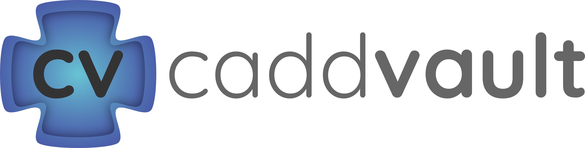

# CADD Vault Frontend

**A modern web interface for browsing and managing CADD (Computer-Aided Drug Design) software packages and tools.**

This frontend application provides a user-friendly experience to interact with the CADD Vault database, allowing users to filter, search, view details, and potentially manage package information (admin functionality).

## ✨ Key Features

*   **Package Browsing:** View a list or grid of CADD software packages.
*   **Filtering & Searching:** Dynamically filter packages based on tags, categories, licenses, etc.
*   **Detailed View:** See comprehensive information for each package, including descriptions, links, citations, and usage details.
*   **Responsive Design:** Adapts to various screen sizes for desktop and mobile viewing.
*   **Theme Toggle:** Switch between light and dark modes.
*   **(Potential) Admin Features:** Add, edit, or delete package information (requires admin authentication).

## 🚀 Tech Stack

*   **Framework:** [React](https://react.dev/) (v19) with [TypeScript](https://www.typescriptlang.org/)
*   **Build Tool:** [Vite](https://vitejs.dev/)
*   **UI Library:** [Material UI (MUI)](https://mui.com/)
*   **State Management:** [Zustand](https://github.com/pmndrs/zustand)
*   **Routing:** [React Router DOM](https://reactrouter.com/)
*   **Backend:** [Firebase](https://firebase.google.com/) (Firestore Database, Authentication)
*   **Styling:** Emotion (via MUI), CSS Modules (potentially)
*   **Linting/Formatting:** ESLint, Prettier (implied via config)

## License

Distributed under the MIT License. See `LICENSE` file in the repository root for more information.
